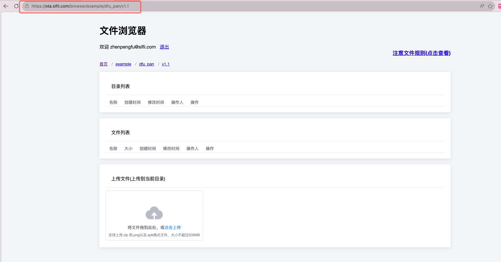
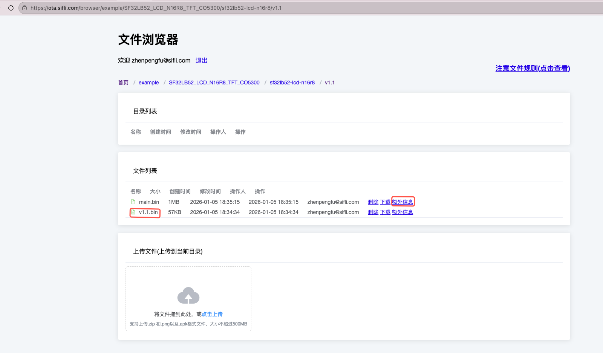
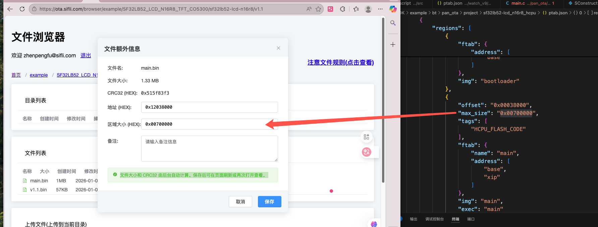
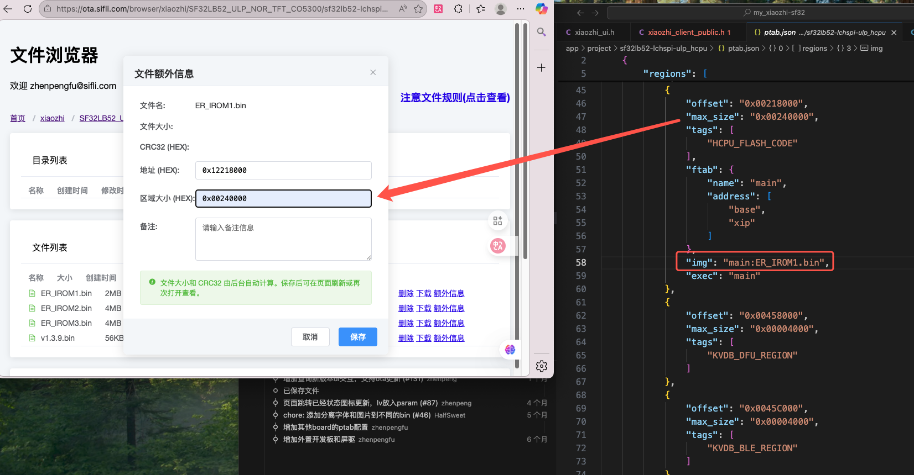
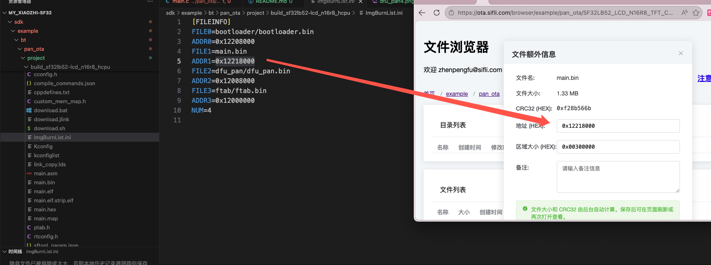
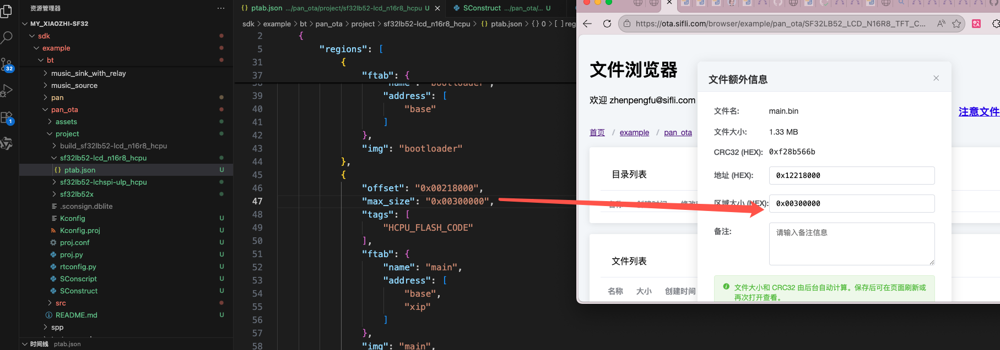
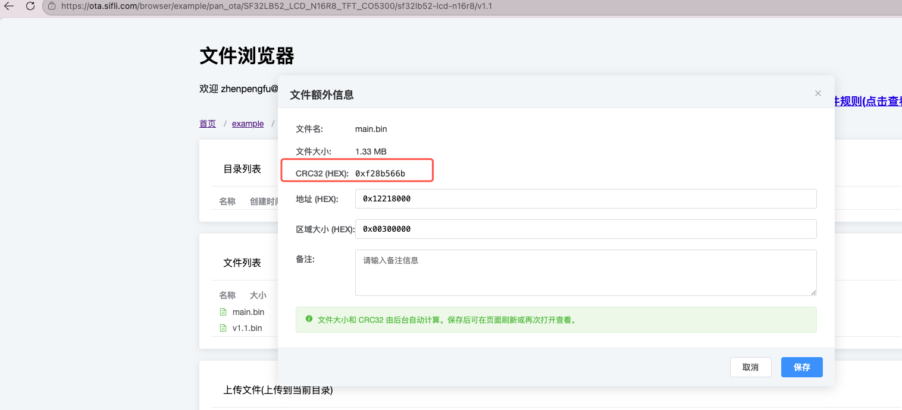
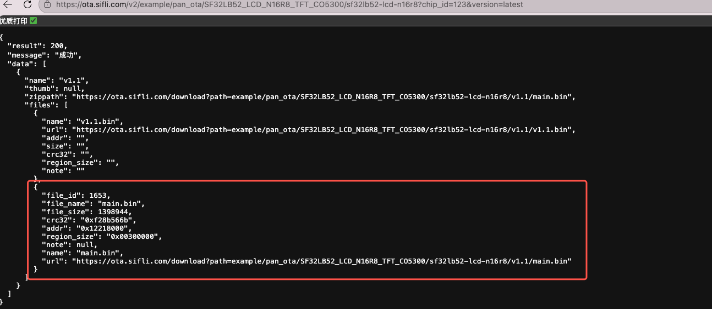

# DFU_PAN OTA升级使用说明文档

## 1. 概述

DFU_PAN是一个基于蓝牙PAN网络的OTA固件升级中间件，它允许设备通过蓝牙网络连接到OTA服务器，下载并更新固件。整个流程包括设备注册、版本检查、固件下载和更新等步骤。

想使用DFU_PAN功能需添加examplele/dfu_pan子工程，搭配middleware/dfu_pan中间件实现

1.主程序project/proj.conf文件中添加，使能DFU_PAN功能
```
CONFIG_USING_DFU_PAN=y
```

2.需要在主工程project/SConstruct文件下添加子工程语法： 
```
AddDFU_PAN(SIFLI_SDK)
```
位置通常是DoBuilding(TARGET, objs)下方

具体可参考example/bt/pan_ota例程使用DFU_PAN
## 2. 工作流程总览

```
1. 设备启动 → 2. 设备注册 → 3. 版本检查 → 4. 设置更新标志 → 5. 重启进入OTA模式 
     ↓
6. DFU_PAN程序运行 → 7. 下载固件 → 8. 验证固件 → 9. 重启进入正常模式
```

## 3. 详细使用步骤

### 3.1 设备注册流程

设备在首次连接时需要向OTA服务器注册，以便服务器识别设备并记录设备信息。

**实现**：dfu_pan提供注册接口，应用需要准备设备信息，其中选填的参数可以不要

```c
// Device registration request parameters structure
typedef struct {
    const char* mac;          // MAC地址 (必填)
    const char* model;        // 设备型号 (必填)
    const char* solution;     // 解决方案名称 (必填)
    const char* version;      // 当前版本 (必填)
    const char* ota_version;  // OTA版本 (必填)
    const char* screen_width; // 屏幕宽度 (可选)
    const char* screen_height;// 屏幕高度 (可选)
    const char* flash_type;   // Flash类型 (可选)
    const char* chip_id;      // 芯片ID (必填)
} device_register_params_t;
```

**流程**:
1. 构造设备注册参数:
   - MAC地址
   - 设备型号
   - 解决方案名称
   - 当前版本号
   - OTA版本号
   - 芯片ID (使用SHA256生成的唯一ID)
- ota_server_url：https://xxx.xxx.com

2. 调用 `dfu_pan_register_device(ota_server_url, &reg_params)`
- dfu_pan_register_device内部post请求的api：https://xxx.xxx.com/register

例如：
```c
// 构造注册参数
device_register_params_t reg_params = {0};
reg_params.mac = get_mac_address();
reg_params.model = "sf32lb52-lchspi-ulp";
reg_params.solution = "SF32LB52_ULP_NOR_TFT_CO5300";
reg_params.version = VERSION;
reg_params.ota_version = VERSION;
reg_params.chip_id = get_client_id();

// 执行注册
int result = dfu_pan_register_device("https://xxx.xxx.com", &reg_params);
```
json:
```json
{
      "mac": "必填", 
      "model": "必填",
      "solution": "必填",
      "version": "必填",
      "ota_version": "必填",
      "screen_width": "可选",
      "screen_height": "可选",
      "flash_type": "可选",
      "chip_id": "必填"
    }

```


**注意**: 其中`solution`，`model`字段最好与文件夹一致，如文件夹结构为`"https://xxx.xxx.com/v2/xiaozhi/SF32LB52_ULP_NOR_TFT_CO5300/sf32lb52-lchspi-ulp?chip_id=%s&version=latest"`
### 3.2 版本检查流程

注册成功后，设备可查询服务器是否有新版本固件。　


**流程**:
1. 构建查询URL，包含设备的chip_id和当前版本
2. 调用 `dfu_pan_query_latest_version()` 查询最新版本
3. 如果有新版本，则保存固件信息到Flash

```c
// 构建查询URL
char* chip_id = get_client_id();
char* dynamic_ota_url = build_ota_query_url(chip_id);
// 查询最新版本
int result = dfu_pan_query_latest_version(dynamic_ota_url, VERSION, 
                                       latest_version, sizeof(latest_version));
```
其中`build_ota_query_url`需要应用端实现，用于构建URL,
例：
```c
dynamic_ota_url ："https://xxx.xxx.com/v2/xiaozhi/SF32LB52_ULP_NOR_TFT_CO5300/sf32lb52-lchspi-ulp?chip_id=%s&version=latest"
//其中SF32LB52_ULP_NOR_TFT_CO5300/sf32lb52-lchspi-ulp是依据服务器文件部署层级
```

**注意**: dfu_pan_query_latest_version()会获取服务器返回的json数据，并将固件结构体写入flash地址，以便后面直接下载，json如下，其中v1.3.9.bin是占位符文件，需要与固件文件放在一起，并与当前文件夹名称一致
```json
{
  "result": 200,
  "message": "成功",
  "data": [
    {
      "name": "v1.3.9",
      "thumb": null,
      "zippath": "https://xxx.xxx.com/download?path=xiaozhi/SF32LB52_ULP_NOR_TFT_CO5300/sf32lb52-lchspi-ulp/v1.3.9/v1.3.9.bin",
      "files": [
        {
          "file_id": 391,
          "file_name": "ER_IROM3.bin",
          "file_size": 4087608,
          "crc32": "0x1026622b",
          "addr": "0x12460000",
          "region_size": "0x00680000",
          "note": null,
          "name": "ER_IROM3.bin",
          "url": "https://xxx.xxx.com/download?path=xiaozhi/SF32LB52_ULP_NOR_TFT_CO5300/sf32lb52-lchspi-ulp/v1.3.9/ER_IROM3.bin"
        },
        {
          "name": "v1.3.9.bin",
          "url": "https://xxx.xxx.com/download?path=xiaozhi/SF32LB52_ULP_NOR_TFT_CO5300/sf32lb52-lchspi-ulp/v1.3.9/v1.3.9.bin",
          "addr": "",
          "size": "",
          "crc32": "",
          "region_size": "",
          "note": ""
        },
        {
          "file_id": 389,
          "file_name": "ER_IROM1.bin",
          "file_size": 2036952,
          "crc32": "0xbffebc91",
          "addr": "0x12218000",
          "region_size": "0x00240000",
          "note": null,
          "name": "ER_IROM1.bin",
          "url": "https://xxx.xxx.com/download?path=xiaozhi/SF32LB52_ULP_NOR_TFT_CO5300/sf32lb52-lchspi-ulp/v1.3.9/ER_IROM1.bin"
        },
        {
          "file_id": 390,
          "file_name": "ER_IROM2.bin",
          "file_size": 3939852,
          "crc32": "0x32d58690",
          "addr": "0x12AE0000",
          "region_size": "0x00400000",
          "note": null,
          "name": "ER_IROM2.bin",
          "url": "https://xxx.xxx.com/download?path=xiaozhi/SF32LB52_ULP_NOR_TFT_CO5300/sf32lb52-lchspi-ulp/v1.3.9/ER_IROM2.bin"
        }
      ]
    }
  ]
}
```

**固件信息结构体**:

```c
struct firmware_file_info {
    char name[48];         // 文件名
    char url[256];         // 下载URL
    uint32_t addr;         // Flash地址
    uint32_t size;         // 文件大小
    uint32_t crc32;        // CRC32校验值
    uint32_t region_size;  // 区域大小
    uint32_t file_id;      // 文件ID
    uint32_t needs_update; // 更新标志
    uint32_t magic;        // 魔数
};
```
### 3.3 设置更新标志

当检测到新版本时，需要设置更新标志，以便下次启动时进入OTA模式。

**流程**:
1. 用户在UI上点击"更新"按钮，或具体触发更新操作位置
2. 调用 `dfu_pan_set_update_flags()`设置更新标志
3. 系统重启

```c
// 设置更新标志
if (dfu_pan_set_update_flags() != 0) {
    LOG_E("Failed to mark versions for update");
    return;
}

// 重启系统经boot判断魔数及更新标志位进入OTA下载程序
HAL_PMU_Reboot();
```
```c 
//其中`dfu_pan_set_update_flags`会将`firmware_file_info`中的 `magic`，`needs_update` 分别设置
// Magic number definitions
#define FIRMWARE_INFO_MAGIC                                                    \
    0x64667500 // ASCII value of "dfu", ensuring 4-byte alignment
#define FIRMWARE_INFO_MAGIC_PAN                                                \
    0x70616E00 // ASCII value of "pan", ensuring 4-byte alignment
#define FIRMWARE_MAGIC_DFU_PAN                                                 \
    ((uint32_t)FIRMWARE_INFO_MAGIC << 16 | (FIRMWARE_INFO_MAGIC_PAN & 0xFFFF))

    needs_update = 1
```
### 3.4 启动引导检查更新标志

系统重启后，bootloader会检查是否有更新标志。

**流程**:
1. 检查Flash中存储的固件信息
2. 验证magic number和更新标志
3. 如果需要更新且OTA程序有效，则跳转到OTA程序

```c
// 检查更新标志
bool needs_update = 0;
for (int i = 0; i < MAX_FIRMWARE_FILES; i++) {
    // 检查magic number
    uint32_t magic_value = 0;
    g_flash_read(magic_addr, (const int8_t*)&magic_value, sizeof(uint32_t));
    
    if (magic_value == FIRMWARE_MAGIC_DFU_PAN) {
        // 检查更新标志
        uint32_t needs_update_value = 0;
        g_flash_read(needs_update_addr, (const int8_t*)&needs_update_value, 
                     sizeof(uint32_t));
        
        if (needs_update_value) {
            needs_update = 1;
            break;
        }
    }
}

// 如果需要更新且OTA程序有效，则跳转
if (needs_update && is_ota_program_valid(DFU_PAN_LOADER_START_ADDR)) {
    run_img(DFU_PAN_LOADER_START_ADDR);  // 跳转到OTA程序
}
```

### 3.5 DFU_PAN程序执行固件下载

进入OTA模式后，DFU_PAN程序会自动连接网络并下载固件。

**流程**:
1. 初始化蓝牙并连接PAN网络
2. 自动检查网络连接状态
3. 从Flash读取固件信息
4. 调用 `dfu_pan_download_firmware()` 下载固件
5. 下载完成后清除更新标志并重启

```c
// 读取固件信息
struct firmware_file_info firmware_files[MAX_FIRMWARE_FILES];
int file_count = 0;
for (int i = 0; i < MAX_FIRMWARE_FILES; i++) {
    if (dfu_pan_get_firmware_file_info(i, &firmware_files[file_count]) == 0) {
        if (firmware_files[file_count].name[0] != '\0') {
            file_count++;
        }
    }
}

// 下载固件
int ret = dfu_pan_download_firmware(firmware_files, file_count);
if (ret == 0) {
    dfu_pan_clear_files();  // 清除更新标志
    HAL_PMU_Reboot();       // 重启进入正常模式
}
```

### 3.6 固件下载和验证过程

**流程**:
1. 遍历所有需要更新的固件文件
2. 为每个文件:
   - 擦除目标Flash区域
   - 通过HTTP GET请求下载固件
   - 分块写入Flash
   - 显示下载进度
   - 计算并验证CRC32校验和

```c
// 下载每个固件文件
for (int i = 0; i < file_count; i++) {
    // 擦除Flash
    rt_flash_erase(firmware_file_info[i].addr, aligned_size);
    
    // 创建HTTP会话
    session = webclient_session_create(PAN_OTA_HEADER_BUFSZ);
    
    // 发送GET请求
    int resp_status = webclient_get(session, firmware_file_info[i].url);
    
    // 分块下载并写入Flash
    while (remaining_length > 0) {
        int bytes_read = webclient_read(session, buffer, chunk_size);
        rt_flash_write(addr, (uint8_t *)buffer, bytes_read);
    }
    
    // CRC校验
    uint32_t calculated_crc = calculate_crc32(verify_buffer, verify_chunk, 
                                             calculated_crc);
    if (calculated_crc != firmware_file_info[i].crc32) {
        // 校验失败
        return -1;
    }
}
```


## 4. CRC32 校验算法说明

DFU_PAN OTA 升级过程中使用 CRC32 校验算法来确保固件数据的完整性。该算法实现与标准 CRC32（IEEE 802.3）一致，具体逻辑如下：

### 4.1 CRC32 算法参数

- **多项式**：0xEDB88320（标准 IEEE 802.3 CRC32 多项式）
- **初始值**：0xFFFFFFFF
- **最终异或值**：0xFFFFFFFF
- **输入数据反转**：否
- **输出数据反转**：否

### 4.2 算法实现

#### 4.2.1 CRC32 表初始化

```c
#define CRC32_POLY 0xEDB88320
static uint32_t crc32_table[256];

static void init_crc32_table(void)
{
    for (int i = 0; i < 256; i++)
    {
        uint32_t crc = i;
        for (int j = 0; j < 8; j++)
        {
            if (crc & 1)
                crc = (crc >> 1) ^ CRC32_POLY;
            else
                crc >>= 1;
        }
        crc32_table[i] = crc;
    }
}
```

#### 4.2.2 CRC32 计算函数

```c
static uint32_t calculate_crc32(const uint8_t *data, size_t length, uint32_t crc)
{
    static int crc_table_initialized = 0;

    // 确保 CRC 表只初始化一次
    if (!crc_table_initialized)
    {
        init_crc32_table();
        crc_table_initialized = 1;
    }

    crc = crc ^ 0xFFFFFFFF;
    for (size_t i = 0; i < length; i++)
    {
        crc = (crc >> 8) ^ crc32_table[(crc ^ data[i]) & 0xFF];
    }
    return crc ^ 0xFFFFFFFF;
}
```

### 4.3 算法工作流程

1. **表初始化**：在首次调用时初始化 256 项 CRC32 查找表
2. **初始值处理**：将初始 CRC 值与 0xFFFFFFFF 异或
3. **数据处理**：对输入数据的每个字节：
   - 计算索引：`(当前CRC值 ^ 字节值) & 0xFF`
   - 更新CRC：`(当前CRC值 >> 8) ^ crc32_table[索引]`
4. **最终值处理**：将结果与 0xFFFFFFFF 异或得到最终 CRC32 值

### 4.4 在固件验证中的应用

在固件下载完成后，系统会进行 CRC32 校验以验证固件完整性：

```c
// 从 Flash 读取已下载的固件数据
uint8_t *verify_buffer = rt_malloc(OTA_RECV_BUFF_SIZE);
uint32_t calculated_crc = 0xffffffff;
uint32_t verify_remaining = data_written; // 实际写入的数据大小
uint32_t verify_offset = 0;

// 分块读取并计算 CRC32
while (verify_remaining > 0)
{
    int verify_chunk = (verify_remaining > OTA_RECV_BUFF_SIZE) 
                          ? OTA_RECV_BUFF_SIZE 
                          : verify_remaining;

    if (rt_flash_read(firmware_file_info[i].addr + verify_offset,
                      verify_buffer, verify_chunk) != verify_chunk)
    {
        // 读取失败处理
        rt_free(verify_buffer);
        return -1;
    }

    // 累积计算 CRC32
    calculated_crc = calculate_crc32(verify_buffer, verify_chunk, calculated_crc);

    verify_remaining -= verify_chunk;
    verify_offset += verify_chunk;
}

// 比较计算出的 CRC 与服务器提供的 CRC 值
if (calculated_crc != firmware_file_info[i].crc32)
{
    // CRC 校验失败，固件可能损坏
    return -1;
}
```

### 4.5 注意事项

1. **一致性要求**：服务器端生成的 CRC32 值必须使用相同的算法和参数
2. **数据完整性**：整个固件文件必须完整下载后才能进行 CRC 校验
3. **错误处理**：CRC 校验失败时应终止更新流程并报告错误
4. **性能优化**：使用查找表方法提高计算效率，避免每次计算都进行位运算

通过以上 CRC32 校验机制，DFU_PAN 能够有效确保 OTA 升级过程中固件数据的完整性和正确性，防止因传输错误导致的固件损坏。

## 5. 固件包部署
固件包部署是指将固件包上传到服务器，供设备进行下载和安装。

例1 ： 以小智部署ota升级包为例：
1. 创建一个目录，将固件包上传到该目录下:
**注意**：下方服务器地址仅供内部使用
https://ota.sifli.com/browser/ 为文件部署首页，创建目录只需在地址栏填入相创建的目录结构即可,最后一级目录名需要是version号如v1.1





2.上传bin文件固件包，一定要上传一个与version目录同名的bin文件，如图中v1.1.bin，此bin文件起占位符作用反应当前版本，一般项目有版本号迭代，因此部署占位符bin文件需要比项目当前版本更高，最大限度上传3个实际功能固件，固件名称以字母开头即可




3.填写固件信息，上传文件后需要点击每个文件右侧的额外信息进行填写，填写完成后点击保存，可根据自身程序所使用的ptab.json查询固件起始地址和固件大小信息


填写固件起始地址

填写固件区域分配大小


4.点击保存后，再次点击额外信息进行查看是否生成了crc32值


也可以根据响应地址查看，是否能成功响应数据：https://ota.sifli.com/v2/xiaozhi/SF32LB52_ULP_NOR_TFT_CO5300/sf32lb52-lchspi-ulp?chip_id=123&version=latest

**注意**
地址中chip_id应该填写设备ID，此处只为验证是否成功响应，可以填一串任意数字，version填写latest是获取最新固件信息

例2 ：example/pan_ota例程
1. 创建一个目录(目录对应具体代码访问地址)，在网址栏填入目录结构 `https://ota.sifli.com/browser/example/pan_ota/SF32LB52_LCD_N16R8_TFT_CO5300/sf32lb52-lcd-n16r8/v1.1` 将固件包上传到该目录下:


2. 填写固件信息，上传文件后需要点击每个文件右侧的额外信息进行填写，填写完成后点击保存，可根据自身程序所使用的ptab.json查询固件起始地址和固件大小信息

填写固件起始地址


填写固件区域分配大小


3. 点击保存后，再次点击额外信息进行查看是否了crc32值


也可以根据响应地址查看，是否能成功响应数据：https://ota.sifli.com/v2/example/pan_ota/SF32LB52_LCD_N16R8_TFT_CO5300/sf32lb52-lcd-n16r8?chip_id=123&version=latest




