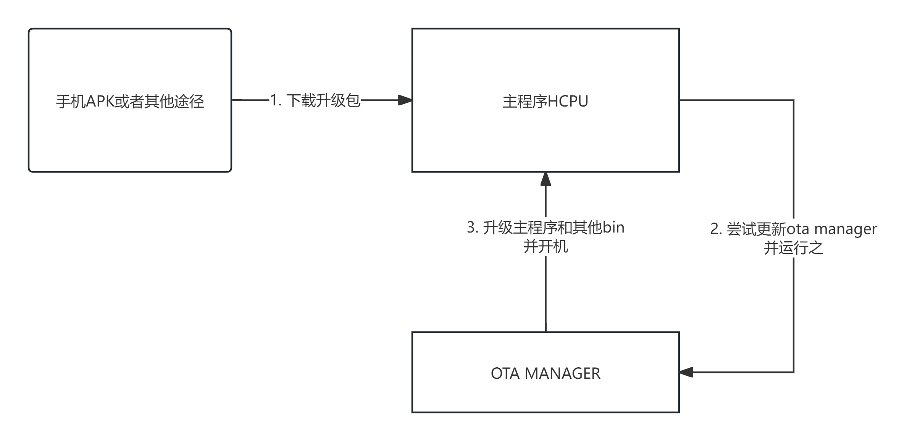

# 流程介绍

## Flash布局

如下图所示，默认Bootrom会根据flash config table跳转到二级boot loader，二级boot loader再根据ftab，跳转到hcpu，执行用户程序。

固件升级服务需要单独创建工程OTA manager，当需要升级时，二级boot loader会跳转到OTA manager，并解压已经下载好的固件升级包，将相关内容写入flash。

 

## 流程简介

1. 通过sifli提供的app，或者接入手机sdk，或者通过其他方式，下载升级包到指定的备份地址。
2. 在用户程序hcpu中，会先检查升级包是否包含ota manager，如果包含，会先行解压安装ota manager。
3. 安装完ota manager之后，或者是不包含ota manager升级，会重启运行ota manager(非55x)或者直接跳转ota manager(55x)。
4. ota manager会解压安装其余的bin，安装完成后，重启进入用户程序，升级完成。

## 工程示例和配置

见example/ble/peripheral_with_ota工程以及对应README: {doc}`../../example/ble/peripheral_with_ota/README`
