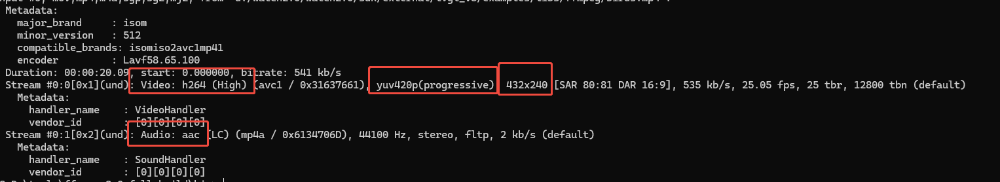

#### <center>视频文档</center>
视频解码使用了ffmpeg引擎，需要配置ffmpeg，见exernal/ffmpeg/Kconfig，完全使用了软件解码，视频需要转换为h264或mjpeg简洁编码才能解码显示。也支持思澈自定义的ezip编码，使用硬件解码ezip。ezip不支持帧间压缩，就是每张图片用ezip压缩，再加上声音，还是使用mp4封装， 对外调用接口不变。
##### 内存要求
代码大小:      310K bytes
全局变量:      1K bytes
动态申请内存:  3.3M byte 240 * 320 (包含3帧视频YUV缓冲). 
##### 性能指标
- 最大播放尺寸在240 * 320左右可以达到30fps，再大了要降低帧率才行，具体也跟图像细节复杂度有关，细节太复杂，压缩率低，解码慢。
- 目前软件要求转换后的视频宽度是16的整数倍。(否则会花屏，因为ffmepg解码后每行会padding对齐到16的整数倍，得降低性能从ffmpeg里一行行复制数据才能正常显示）
##### 支持的音视频codec格式
 - h264
 - h263
 - mp3
 - aac
 - mjpeg
 - ezip
 - opus
 - vorbis
##### 支持的音视频封装格式
 - ogg
 - mp4
##### 配置说明
需要在menuconfig中打开PKG_USING_FFMPEG才能支持ffmpeg，如果要支持mp4文件中的音频，还要选择打开PKG_USING_FFMPEG_AUDIO， 如果要支持网络视频，还要打开PKG_USING_FFMPEG_HTTP。
如果要支持mjpeg，要打开PKG_USING_FFMPEG_MJPEG（在58x芯片平台上才会硬件解码，软件解码不建议）  


##### 工具链
通常视频尺寸比较大，视频格式也比较复杂，需要转换后才能显示。
###### ffmpeg 官方工具链
 可以到 https://ffmpeg.org 现在官方ffmpeg工具链，下载解压后包含：
  * 视频转换、裁剪、缩放工具 ffmpeg.exe
  * 视频格式查看工具 ffprobe.exe
  * 视频播放工具 ffplay.exe  

这个一般是本地调试用, ffprobe.exe teste.mp4的例子


上面high表示是高质量编码格式, 这个软件解码没法支持，要转为baseline。
本地调试的转换命令是：
```python
#
ffmpeg -i input.mp4 -profile:v baseline -level 1.0 -r 30 -acodec mp3 -ar 44100 -ac 2 output.mp4
# -profile:v baseline -level 1.0表示转为baseline格式
# -r 30 表示帧率为30， 可根据图像大小适当降低以降低cpu占用率
# -acodec mp3表示mp3编码，也可以用-acodec aac编码为aac
# -ar 44100表示音频采样率
# -ac 2 表示双声道，可以用-ac 1用单声道减小视频文件大小
# 命令中的输出的文件扩展名定要用mp4，不然可能无法转换。
```
```
# 转为mjpeg格式
ffmpeg -i input.mp4 -c:v mjpeg -c:a copy -vf "colorspace=bt709:iall=bt470bg:range=pc" video_example.mp4
```

转换后可以用ffprobe.exe看看文件格式， 也可以用ffplay.exe播放看看。

###### 思澈工具链
   在ffmpeg官方工具链基础上封装的图像转换工具， 使用方法在工具下有文档。 
   GraphicsTool https://wiki.sifli.com/tools/index.html
   如果要转换为ezip图像编码格式，只能使用这个工具。
   ezip格式无法用ffplay.exe播放，只能在板子播放。

##### 视频转换
- 视频转换可以用上面提到的ffmpeg官方工具(不支持ezip)或思澈工具，官方工具使用可以ffmpeg -h或ffmpeg -h full查看帮助，也可以网络上搜索ffmpeg常用的命令。
- 要求转换后的宽度是16的整数倍，编码格式为baseline

##### example
- 播放本地文件的例子：
原来disk目录下是个空文件，需要用转换后的baseline格式mp4文件替换。  
https://gitee.com/SiFli/sifli-sdk/tree/main/example/multimedia/lvgl/lvgl_v8_media

- 播放网络视频文件的例子：
需要打开手机BT pan，并共享网络和热点。  
https://gitee.com/SiFli/sifli-sdk/tree/main/example/multimedia/lvgl/streaming_media

##### 接口说明
API参考media_dec.h
```c
/**
 * @brief open a media URL to play
 *
 * @param return_hanlde return the handle
 * @param cfg configure for media info @see ffmpeg_config_t
 * @param user_data The user data that will be passed to notify() in ffmpeg_config_t
 *
 * @return 0 if successful, negative errno code if failure.
 */
 int ffmpeg_open(ffmpeg_handle *return_hanlde, ffmpeg_config_t *cfg, uint32_t user_data);

/**
 * @brief stop ffmpeg playing
 *
 * do not call this in callback functioin notify()
 *
 * @param hanlde the handle got by ffmpeg_open()
 *
 */
void ffmpeg_close(ffmpeg_handle hanlde);

/**
 * @brief pause ffmpeg playing
 *
 * do not call this in callback functioin notify()
 *
 * @param hanlde the handle got by ffmpeg_open()
 *
 */
void ffmpeg_pause(ffmpeg_handle hanlde);

/**
 * @brief resume ffmpeg playing
 *
 * do not call this in callback functioin notify()
 *
 * @param hanlde the handle got by ffmpeg_open()
 *
 */
void ffmpeg_resume(ffmpeg_handle hanlde);

/**
 * @brief seek ffmpeg playing
 *
 * do not call this in callback functioin notify()
 *
 * @param hanlde the handle got by ffmpeg_open()
 * @param second seek to seconds from beginning
 *
 */
void ffmpeg_seek(ffmpeg_handle hanlde, uint32_t second);

/**
 * @brief mute/unmute audio
 *
 * @param hanlde the handle got by ffmpeg_open()
 * @param is_mute mute or unmute audio. 1--mute, 0-- unmute
 *
 */
void ffmpeg_audio_mute(ffmpeg_handle hanlde, bool is_mute);

/**
 * @brief release memory alloced by ffmpeg_eizp_release() or ffmpeg_get_first_ezip_in_nand()
 *
 * @param ezip alloced memory address by ffmpeg_eizp_release() or ffmpeg_get_first_ezip_in_nand()
 */
void ffmpeg_eizp_release(uint8_t *ezip);


/**
 * @brief get first ezip in local disk media file
 *
 * @param filename the file name in local disk
 * @param[out] w return picture width
 * @param[out] h return picture height
 * @param[out] psize return picture size in bytes
 * @return non-NULL poiner in memory for first picure, should release by ffmpeg_eizp_release(), return NULL if error
 */
uint8_t *ffmpeg_get_first_ezip(const char *filename, uint32_t *w, uint32_t *h, uint32_t *psize);

/**
 * @brief get first ezip nand
 *
 * @param nand_address media address in nand
 * @param nand_size media size in nand
 * @param[out] w return picture width
 * @param[out] h return picture height
 * @param[out] psize return picture size in bytes
 * @return non-NULL poiner in memory for first picure, should release by ffmpeg_eizp_release(), return NULL if error
 */
uint8_t *ffmpeg_get_first_ezip_in_nand(const char *nand_address, uint32_t nand_size,
                                       uint32_t *w, uint32_t *h, uint32_t *psize);

/**
 * @brief get video infomation
 *
 * @param hanlde the handle got by ffmpeg_open()
 * @param[out] video_width return picture width
 * @param[out] video_heightreturn picture height
 * @param[out] info picture format
 * @return 0 if successful, negative errno code if failure.
 */
int ffmpeg_get_video_info(ffmpeg_handle hanlde, uint32_t *video_width, uint32_t *video_height, video_info_t *info);

/**
 * @brief get new frame in ffmepg cache, should call ffmpeg_is_video_available() first, call this if new video frame available
 *
 * @param hanlde the handle got by ffmpeg_open()
 * @param data get the new frame data, diffrent format has diffrent means in *data, @see sifli_gpu_fmt_t
 *             format is return by ffmpeg_get_video_info()
 *             1. if format is e_sifli_fmt_ezip
 *                data[0] -- data addr
 *                data[1] -- data size
 *                data[2] -- IMG_DESC_FMT_EZIP
 *             2. if format e_sifli_fmt_mjpeg
 *                data[0] -- data addr
 *                data[1] -- unused
 *                data[2] -- unused
 *             3. if format e_sifli_fmt_yuv420p, app can use yuv directly for 52x/56x/57x chip
 *                data[0] -- y address
 *                data[1] -- u address
 *                data[2] -- v address
 * @return true if new frame decoded in ffmpeg cache, false no new frame decoded
 */
int ffmpeg_next_video_frame(ffmpeg_handle hanlde, uint8_t *data);

/**
 * @brief check video cache if a new frame is decoded to display
 *
 * @param hanlde the handle got by ffmpeg_open()
 *
 * @return true if new frame decoded in ffmpeg cache, false no new frame decoded
 */
bool ffmpeg_is_video_available(ffmpeg_handle hanlde);

/**
 * @brief check if there is a ffmpeg handle is playing
 *
 * not thread safe, maybe return a handle, the the handle was close by its user
 *
 * @return ffmpeg handle if exist, NULL if not exist
 */
ffmpeg_handle ffmpeg_player_status_get(void);
```
