# AMOLED功耗测试示例

源码路径: example/pm/amoled

### 支持的开发板
此示例可在以下开发板上运行：
- sf32lb52-core_n16r16

## 概述
在RT-Thread操作系统下,设置了两种模式：一种是灭屏模式（刷屏5s后灭屏进入睡眠）；另一种就是常亮屏模式（刷屏5s后再进入睡眠），两种模式的切换可以通过finsh指令进行切换，其中power_mode 1（从灭屏模式切换到常亮屏模式），power_mode 0（从常亮屏模式切换到灭屏模式）。

* 注意：模式切换需要在唤醒阶段才能切换成功，睡眠阶段进行切模式切换不会生效。

### 模式介绍
* 屏幕的三种模式

* 1. 掉电模式(Power Off Mode):在此模式下，屏幕的绝大部分内部电路都会被关闭,屏幕会完全变黑，不显示任何图像,内部电源电路、驱动IC、背光（对于LCD）或像素点（对于OLED）都会停止工作.

* 2. 睡眠模式(Idel Mode):目的是在保持基本功能运行的同时，尽可能降低功耗，以便能快速恢复到正常工作状态,屏幕通常会停止刷新，保持进入Idle模式前最后一帧的静态图像（但有些屏幕可能会清空显示）,核心的显示驱动器和内存（如GRAM）仍然保持供电，但时钟和扫描电路可能会停止或大幅降低频率.

* 3. 工作模式(Normal Mode):这是屏幕全功能工作的模式，功耗最高, 屏幕正常、持续地刷新，动态显示主机发送过来的图像数据,所有内部电路，包括时钟发生器、扫描驱动器、GRAM、伽马校正电路、电源电路等都处于全速运行状态.

* 工程介绍中的常亮屏模式和灭屏模式

1. 常亮屏模式：是指屏幕的工作状态是为工作模式（Normal Mode）进行刷新，刷新之后芯片模组进入睡眠(Idel Mode)，屏幕不进入睡眠模式。

2. 灭屏模式：屏幕再工作状态是为工作模式（Normal Mode）进行刷新，刷新结束后会让屏幕先进入掉电模式(Power Off Mode)，再让芯片模组进入睡眠。
## 硬件连接
进行低功耗测试时，板子不再通过usb进行供电而是需要通过功耗检测工具对板子的VCC_5V进行5v供电，所以接下来需要进行如下操作才能进行功耗测试。

* 开发板原有供电情况


* 除了ADDIO、PVDD、AVDD的脚调线冒，其余的都摘除
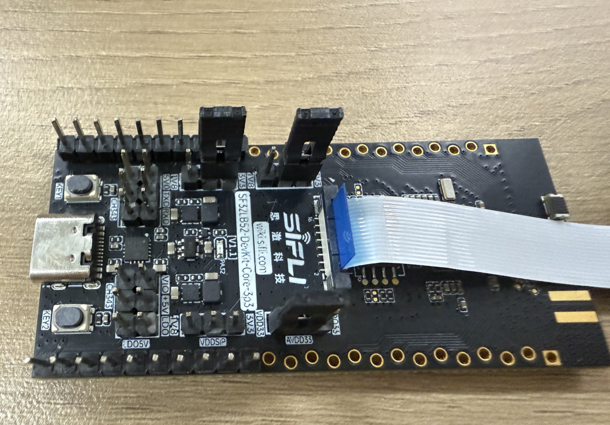

* 将功耗测试工具的VOUT接到板子的VCC_5V上，GND连接到PPK的GND引脚
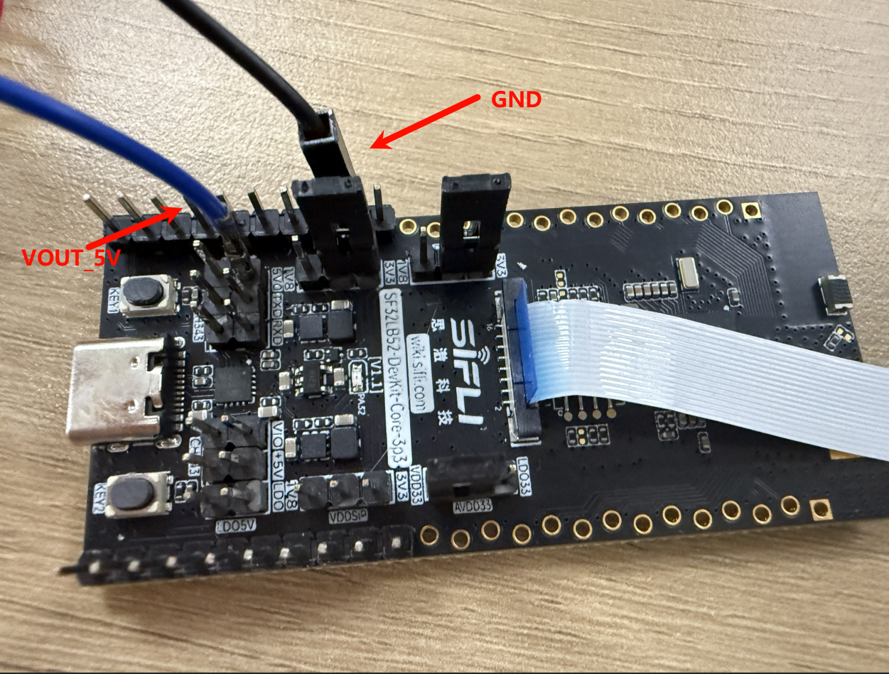

* 为了方便调试，可以将uart转接器进行与板子的TX、RX连接
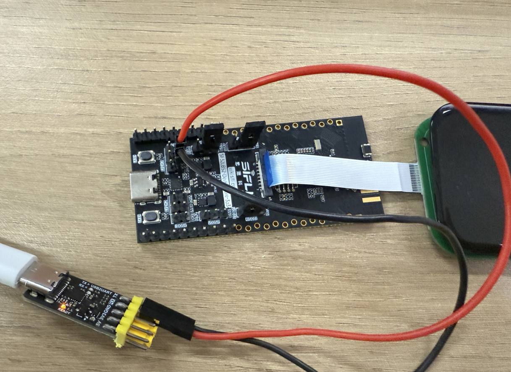

* 最终连线
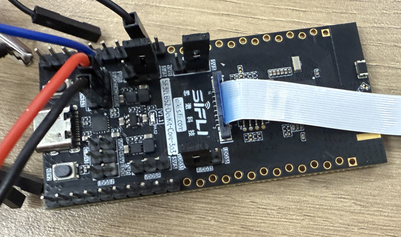

## menuconfig配置
* "默认情况下已经打开了所需的配置

```c
menuconfig --board=board_name
```
1. 使能低功耗模式
- 路径：Sifli middleware 
    - 开启： Enable low power support
        - 宏开关：`CONFIG_BSP_USING_PM`
        - 作用：开启低功耗

2. 打开输出低功耗相关的日志（默认情况是关闭的，为了降低功耗，如果为了进行调试校验，可以自行在menuconfig中打开）
- 路径：SiFli Middleware → Enable Low Power Support
    - 开启：Enable PM Debug
    - 宏开关：`CONFIG_BSP_PM_DEBUG`
    - 作用：输出低功耗相关的日志

### 编译和烧录
52平台默认配置为Deep Sleep模式休眠<br>
切换到例程project目录，运行scons命令执行编译：
```
scons --board=sf32lb52-core_n16r16 -j8
```
烧录：
```
 build_sf32lb52-core_n16r16_hcpu\uart_download.bat

     Uart Download

please input the serial port num:19
```

## 例程输出结果
```SFBL
Serial:c2,Chip:4,Package:6,Rev:f  Reason:00000000
Serial PowerOnMOde:0 rtc_record:00000000

 \ | /
- SiFli Corporation
 / | \     build on Sep  3 2025, 2.4.0 build 0f027d7b
 2020 - 2022 Copyright by SiFli team
mount /dev sucess
[2291] I/drv.rtc main: PSCLR=0x80000100 DivAI=128 DivAF=0 B=256
[2324] I/drv.rtc main: RTC use LXT RTC_CR=00000001

[2344] I/drv.rtc main: Init RTC, wake = 0

rt_flash_config_read addr: 0x1200e000 find handle error
[2535] I/drv.audprc main: init 00 ADC_PATH_CFG0 0x606

[2557] I/drv.audprc main: HAL_AUDPRC_Init res 0

[2581] I/drv.audcodec main: HAL_AUDCODEC_Init res 0

[2604] I/TOUCH main: Regist touch screen driver, probe=1203b845 
call par CFG1(3313)
fc 9, xtal 2000, pll 2129
call par CFG1(3313)
fc 7, xtal 2000, pll 1706
[2866] I/drv.lcd main: [NONE] -> [OPENING]
[2893] I/drv.lcd lcd_task: open
[2908] I/drv.epic lcd_task: drv_gpu opened.
[2926] I/drv.lcd lcd_task: HW open
[2957] I/drv.lcd lcd_task: Try registered LCD driver...
msh />
CO5300_ReadID 0x331100 
[5286] I/co5300 lcd_task: LCD module use CO5300 IC 
[11538] I/drv.lcd lcd_task: Found lcd co5300 id:331100h
[11561] I/drv.lcd lcd_task: HW open done.
[11581] I/drv.lcd lcd_task: [OPENING] -> [INITIALIZED]
[11601] I/drv.lcd lcd_task: open done.
[13554] I/drv.lcd lcd_task: Auto turn on display.
[13576] I/drv.lcd lcd_task: set brightness 50
[13599] I/drv.lcd lcd_task: display on
[13615] I/drv.lcd lcd_task: [INITIALIZED] -> [ON]
[184450] I/drv.lcd lcd_task: Power off
[184470] I/drv.epic lcd_task: drv_gpu closed.
[184488] I/drv.lcd lcd_task: display off
[184508] I/drv.lcd lcd_task: [ON] -> [OFF]
[184526] I/drv.lcd lcd_task: HW close
[184540] I/drv.lcd lcd_task: HW close done.
[184557] I/drv.lcd lcd_task: Power off done
[184577] I/APP.FWK.PM main: gui suspend canel

Key interrupt triggered! system_sleeping=1
Key pressed, waking up system...
[347900] I/drv.lcd lcd_task: Power on
[347918] I/drv.epic lcd_task: drv_gpu opened.
[347936] I/drv.lcd lcd_task: HW open
[347967] I/drv.lcd lcd_task: Init LCD co5300

CO5300_ReadID 0x331100 
[350280] I/co5300 lcd_task: LCD module use CO5300 IC 

Key interrupt triggered! system_sleeping=0
[356508] I/drv.lcd lcd_task: HW open done.
[356525] I/drv.lcd lcd_task: [OFF] -> [INITIALIZED]
[356545] I/drv.lcd lcd_task: Power on done.
[358540] I/drv.lcd lcd_task: Auto turn on display.
[358562] I/drv.lcd lcd_task: set brightness 50
[358583] I/drv.lcd lcd_task: display on
[358600] I/drv.lcd lcd_task: [INITIALIZED] -> [ON]
msh />msh />[529475] I/drv.lcd lcd_task: idle mode on=1
[529501] I/drv.lcd lcd_task: [ON] -> [IDLEMODE]
[529523] I/APP.FWK.PM main: gui suspend canel
```
* 灭屏幕模的板子现象
 唤醒时：
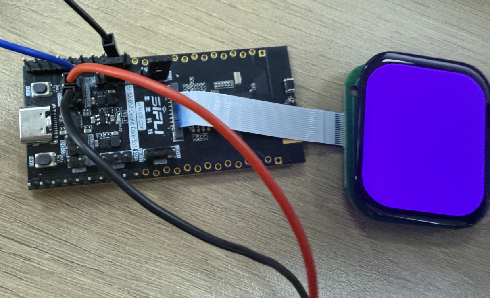
 睡眠时：
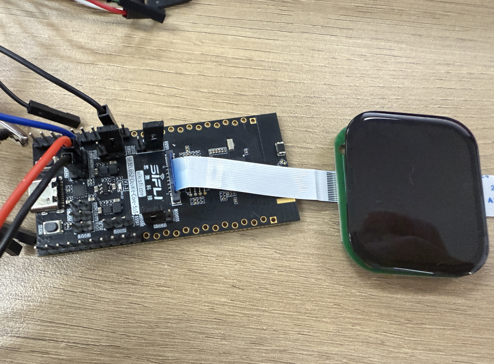

* 常亮屏模式的板子现象
 唤醒时：
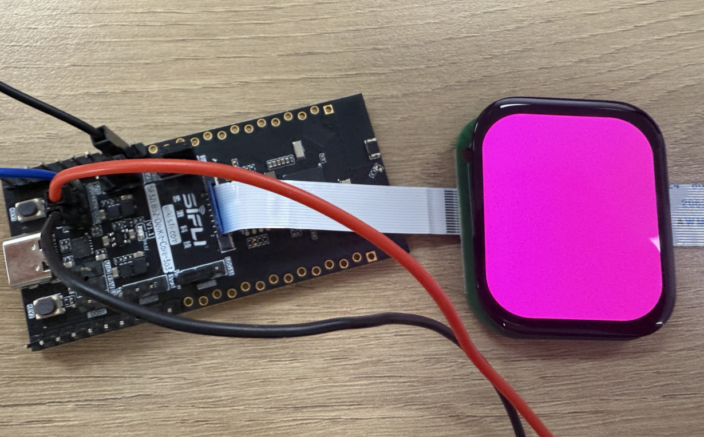
 睡眠时：
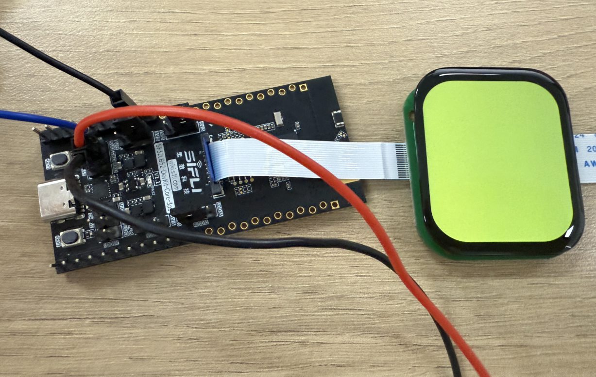

## 功耗测试结果
* 我们以200mAh电池容量为例，在上述两种模式下进行测试，估算设备可使用时间。
* 按轻度使用、中度使用、重度使用三种场景分类，分别对应唤醒100次、300次、500次，每次唤醒后执行5秒的刷屏操作，以模拟人们查看内容的使用时长。
### 灭屏模式

1、按键触发唤醒（用于模拟平时使用手表看时间的情况）
* 按键唤醒后刷屏5s的平均电流为：12.48mA
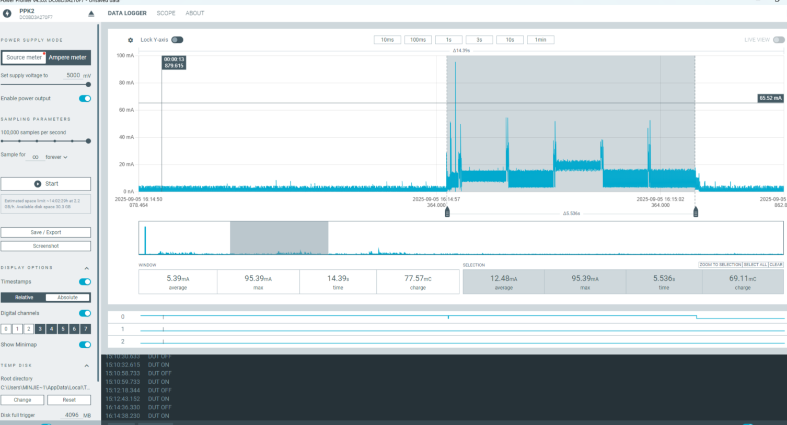

* 使用一天所消耗的功耗
    100次：12.48*100*5/3600 = 1.73（mAh）
    300次：12.48*300*5/3600 = 5.2（mAh） 
    500次：12.48*500*5/3600 = 8.65（mAh）

2、灭屏进入睡眠（用于模拟平时待机状态）
* 灭屏进入睡眠模式的底电流为：49.06uA
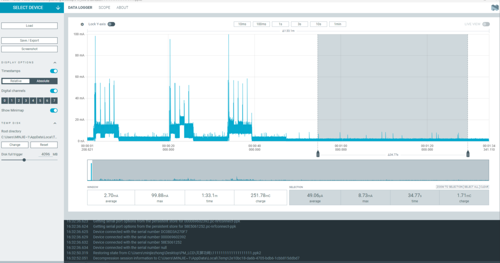

* 灭屏睡眠一小时所需的
    49.6/1000*1=0.0496（mAh）

* 一天总消耗计算如下：
    100次：0.0496 * (24 * 3600 - 100 * 5) + 1.73 = 2.91（mAh）  
    300次：0.0496 * (24 * 3600 - 300 * 5) + 5.20 = 6.37（mAh）
    500次：0.0496 * (24 * 3600 - 500 * 5) + 8.65 = 9.81（mAh）

3、数据汇总
|          |唤醒时亮屏  |灭屏睡眠      |一天的消耗      |可以使用天数 |
|:---      |:---        |:---          |:---           |:---         |
|100次/每天|1.73mAh     |1.18mAh       |2.91mAh        |68.7天       |
|300次/每天|5.20mAh     |1.17mAh       |6.37mAh        |31.4天       |
|500次/每天|8.65mAh     |1.16mAh       |8.65mAh        |23.1天       |

### 常亮屏模式

1、1按键触发唤醒（用于模拟平时使用手表的情况）
* 按键唤醒执行刷屏5s所需的平均电流为：12.38mA
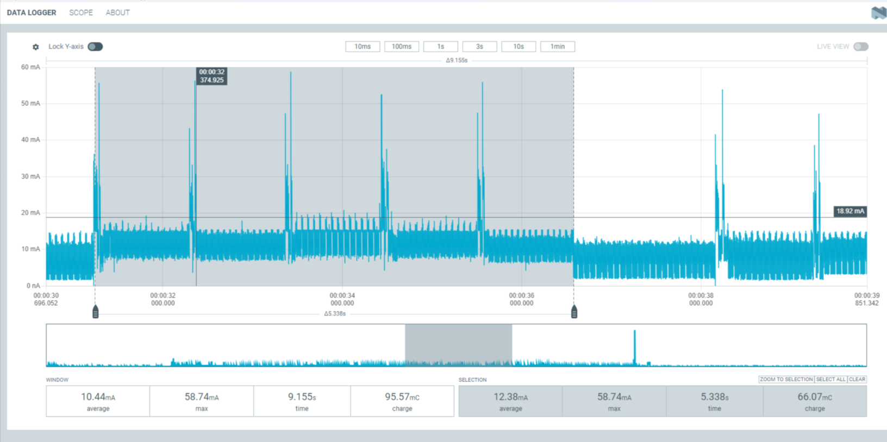

* 使用时所消耗的功耗
    100次：12.48*100*5/3600 = 1.73（mAh）
    300次：12.48*300*5/3600 = 5.2（mAh）
    500次：12.48*500*5/3600 = 8.65（mAh）

2、常亮屏进入睡眠（用于模拟平时亮屏待机状态）
* 常亮屏并进入睡眠模式的底电流为：5.7mA
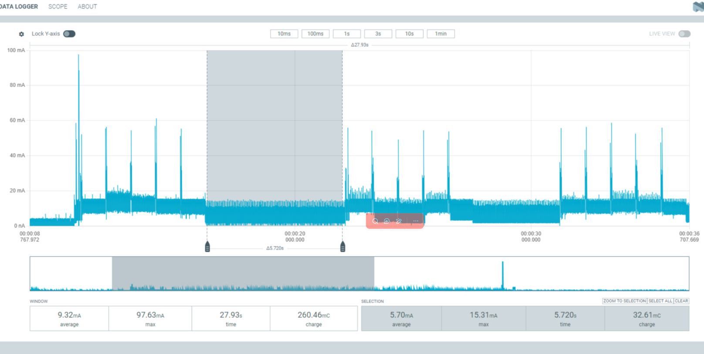
* 亮屏睡眠时一小时所需要的功耗
    5.7*1=5.7（mAh）

* 使用一天的消耗
    100次：5.7*（24*3600-100*5） + 1.73 = 137.73（mAh）
    300次：5.7*（24*3600-300*5） + 5.20 = 139.63（mAh）
    500次：5.7*（24*3600-500*5）+ 8.65 = 141.5（mAh）

3、数据汇总
|          |唤醒时亮屏  |灭屏睡眠      |一天的消耗      |可以使用天数 |
|:---      |:---        |:---          |:---           |:---         |
|100次/每天|1.73mAh     |136mAh       |137.73mAh       |1.45天       |
|300次/每天|5.20mAh     |134.43mAh    |139.63mAh       |1.43天       |
|500次/每天|8.65mAh     |132.85mAh    |141.5mAh        |1.41天       |

## 异常诊断
所测结果与文档中相差较大，可能存在异常，请自行进行排查。
UDDIO:芯片的IO供电
PVDD:芯片主供电输入
AVDD:芯片的音频

1、如果硬件方面有所改动的话，可能会导致测试结果有较大偏差
2、供电电压跟所需电压不匹配也会导致测试结果有较大偏差（采用5V供电）

* 排查步骤：可以把原有的5V供电拔了，以及UDDIO、PVDD、AVDD的跳线帽进行摘除，上述三路可以使用功耗测试工具进行单路供电，其余两路通过外部VCC进行供电，这样可以进行单路的功耗测试，从而排查出哪路电源有异常（注意还需要单独给VCC_3V3进行供电，因为这个是给屏幕单独供电的）。